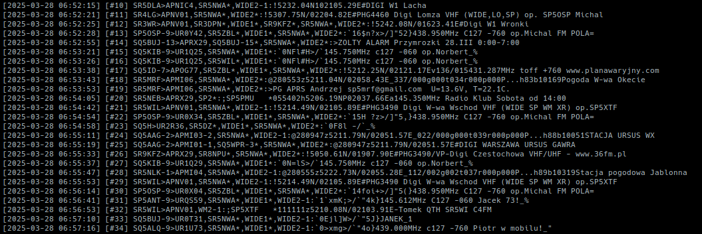

# BASH-iGate-rtl_sdr

## Overview
BASH-iGate-rtl_sdr is a simple, lightweight APRS Internet Gateway (iGate) implemented in Bash. It uses RTL-SDR hardware to receive APRS packets over the radio and forwards them to the APRS-IS network.



## Features
- Super simple - BASH implementation
- Receives APRS packets using rtl_fm and multimon-ng
- Forwards packets to APRS-IS servers
- Sends position and status reports
- Automatically reconnects on connection failure
- Error handling for the RTL-SDR pipeline (not sure)
- Minimal dependencies (uses standard Linux tools)

## Requirements
- Bash shell
- RTL-SDR dongle
- `rtl_sdr` and `multimon-ng` installed
- Standard Unix utilities (grep, stdbuf)

## Installation
1. Clone this repository
2. Install dependencies (in debian-like it should be something like: `apt install rtl-sdr multimon-ng`)
3. Copy `aprs-bash-igate.conf.example` to `aprs-bash-igate.conf`
4. Edit the configuration file with your callsign, location, and APRS-IS credentials

## Configuration
Edit `aprs-bash-igate.conf` with your settings:
```
PORT=14580
USERNAME="ANDY"
CALLSIGN="SP0ABC-1"         # Your full callsign with SSID
PASSCODE="11223"            # Your APRS-IS passcode
FILTER="r/52.001/21.001/50" # Optional filter for your area
LATITUDE="5200.00N"         # This should be 7 digits plus N - check precision
LONGITUDE="02100.00E"       # This should be 8 digits plus E - check precision
SYMBOL="r"                  # https://blog.thelifeofkenneth.com/2017/01/aprs-symbol-look-up-table.html
ppm_error=-1                # ppm_error (default: 0) estimate eg using `rtl_test -p`
#SERVER="radom.aprs2.net"
SERVER="rotate.aprs2.net"

# RTL-SDR Settings
RTL_SDR_FREQUENCY="144800000"
RTL_SDR_SAMPLE_RATE="22050" # You can add this too if needed
```

## Usage
```bash
./aprs-bash-igate.sh
```

The script will:
1. Connect to the APRS-IS server
2. Send an initial position and status report
3. Start listening for APRS packets on 144.800 MHz (configurable)
4. Forward received packets to APRS-IS
5. Automatically reconnect if the connection fails

## Error Handling
The script includes error handling to:
- Detect and report failures in the RTL-SDR pipeline
- Automatically reconnect to APRS-IS if needed
- Validate configuration settings

## License
This project is open source and available under the MIT License.

## Author
Created by filips
